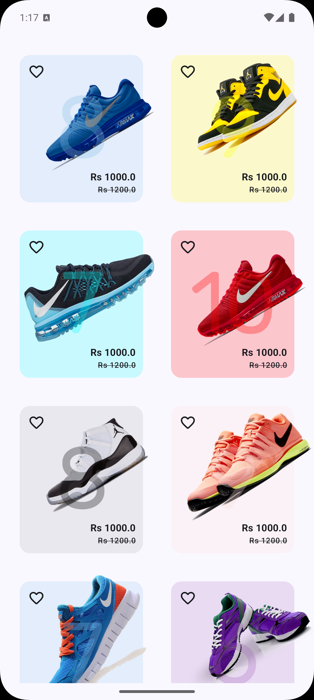
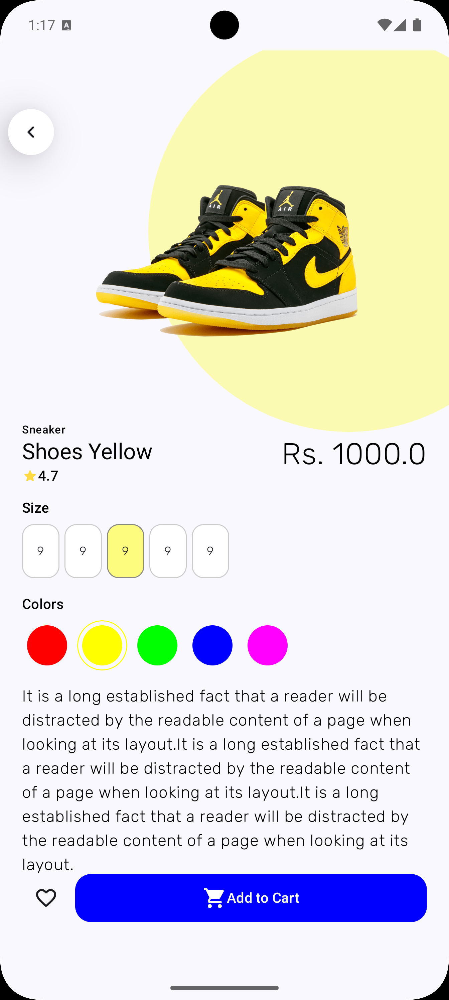
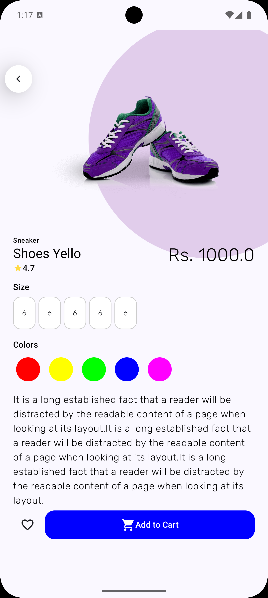
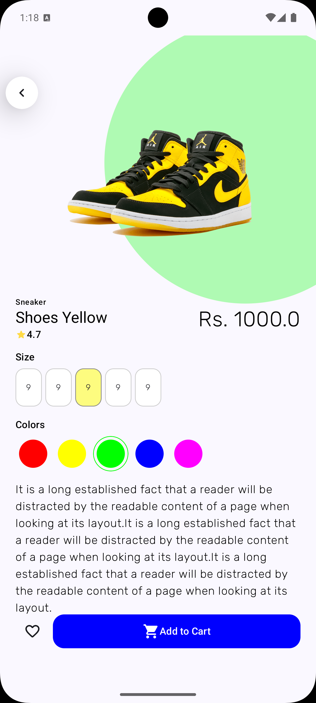
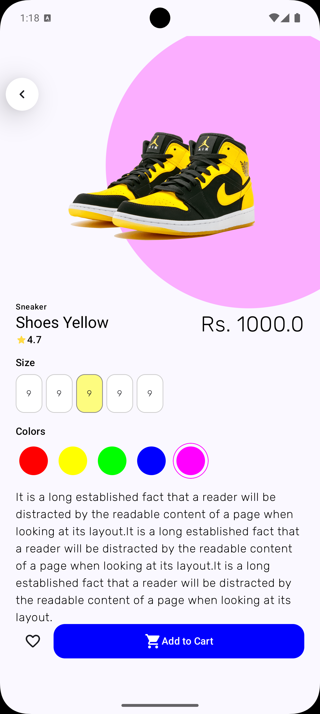
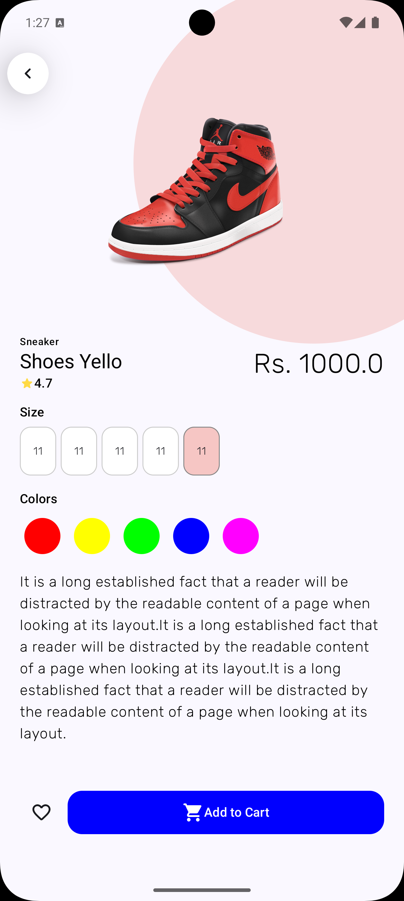
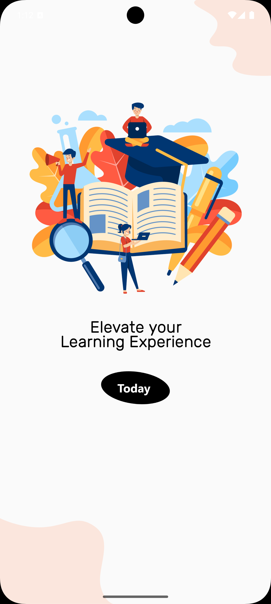
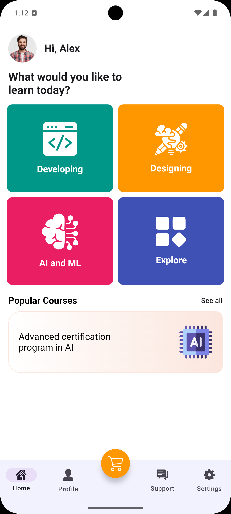

# Compose UI

Welcome to **Compose UI**, an Android project built using Jetpack Compose to practice and experiment with various UI layouts and components. This project serves as a playground for learning and building modern UIs in Android using Jetpack Compose.

## Project Purpose

The purpose of this project is to:
- Explore and practice **Jetpack Compose** for UI development.
- Experiment with various app layouts and UI scenarios.
- Gain hands-on experience in building responsive, modern, and reactive UIs.

Each package in this project focuses on a different UI concept, enabling the development of reusable components and layouts.

## Packages Overview

### 1. `shoes_app_ui`

This package simulates a **Shoes Shopping App** UI. It consists of a product grid to display shoes and a product detail screen.

- **Features:**
    - Grid layout for displaying shoe products with images and prices.
    - Detailed product screen with more information.

#### Screenshots:
            

            


---

### 2. `dashboard_intro_ui`

#### Screenshots:
      

---

## How to Run the Project

To run the project on your local machine:

1. Clone the repository:
   ```bash
   git clone https://github.com/your-username/compose-ui-practice.git

2. Open the project in Android Studio.

3. Build and run the project on an emulator or a physical device to explore the different UIs in each package.

## Future Enhancements
- Add more UI components and app concepts (e.g., e-commerce, social media).
- Implement animations and transitions.
- Explore theming, state management, and Compose side effects.

## Contributing
- Feel free to fork the project, add new UI components, or fix issues. Contributions are welcome!